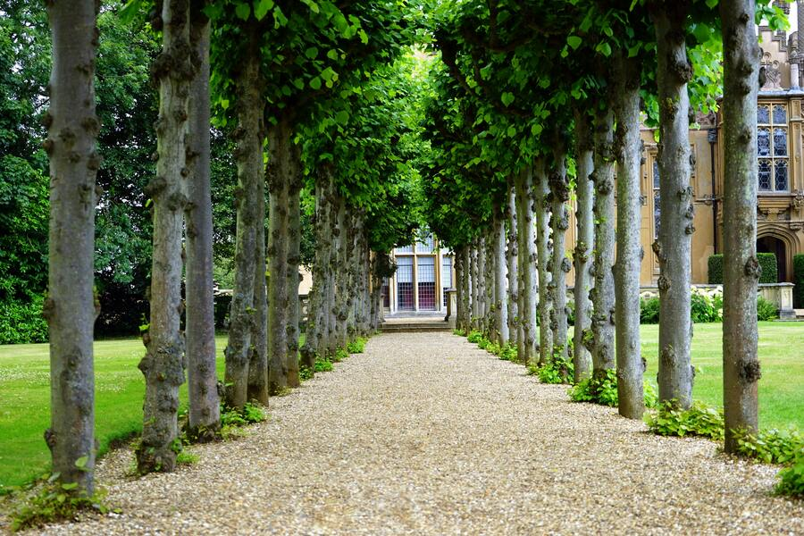

# A custom CUDA kernel for Motion Blur

This is a custom CUDA kernel for generating motion blur as defined by a list of
homography matrices.  A homography matrix defines a deformation of an input image
which maps straight lines to straight lines, but doesn't necessarily preserve angles,
distances or position.  Some examples of homographic transformations include:
displacement, rotation about any point, skew, scale (along any direction).  Another
way you can define a homography transformation is, choose any four points in the
image, and designate some destination position for that point.

To define motion blur, imagine mapping a sequence of slightly different homography
transformations, each to the same image, and then overlaying those images (averaging
the resulting color at each pixel).  A simple example is displacement in some
direction.  However, the displacement need not form a straight line path.  Or, if the
camera is moving forward, the transformations could be scaling in both x and y
directions holding some vanishing point stationary.  If the camera were rotated
within its focal plane (rare) then the image would appear spinning slightly, so
pixels further from the center would have more relative motion.

This kernel is able to simulate all of these situations by defining the homography
trajectory as a series of matrices.  Once defined, these matrices define a piecewise
linear motion path for each source pixel in the image.  The kernel samples locations
from this motion path at regular intervals.

## Building

```bash
git clone https://github.com/hrbigelow/codebits.git
cd codebits/motion-blur
mkdir build
cd build
cmake -DCMAKE_BUILD_TYPE=Release ..
cmake --build .
```

## Running

```bash
./motion_blur

./motion_blur
Usage: ./motion_blur <input_file> <trajectory_file> <viewport_width> <viewport_height> <steps_per_occu_block> <ref_point_x> <ref_point_y> <output_file>
./motion_blur input.png ../test/u-shaped.txt 3140 2060 40.0 1400 800 ~/blurred-input.png
```

See several example trajectories in `test` directory.  The format for these is:

    <num_matrices>
    mat1-row1
    mat1-row2
    mat1-row3
    mat2-row1
    ...
    ...

The remaining lines are rows of each matrix, each row containing three
space-separated numbers.

The trajectory file defines a piecewise-linear trajectory of `N-1` pieces for `N`
matrices.  The system can handle up to 64 matrices for a smoother trajectory.
Viewing this piecewise-linear trajectory as a single path, the system samples
`steps_per_occu_block * occu_blocks` nearly evenly-spaced points along this path.
This quantity is a cheap estimate of a given target location's total path length.
Note that certain trajectories like rotation result in different locations in the
image having different length trajectories.  The program thus samples longer
trajectories with more points so as to maintain fidelity.

The input image may be of any dimensions, and it will be treated as an infinite
canvas that wraps in both x and y directions.  This will of course cause unnatural
sampling artifacts where the blur crosses the image boundary.

All trajectories are defined relative to given reference point `ref_point_x,
ref_point_y`.  This doesn't affect translation trajectories, but it does affect
rotation and zoom, for example.  Mathematically, this is achieved by replacing every
given matrix `M` with:

$$
\begin{bmatrix}
1 & 0 & -x \\
0 & 1 & -y \\
0 & 0 & 1
\end{bmatrix}
\begin{bmatrix}
m_{00} & m_{01} & m_{02} \\
m_{10} & m_{11} & m_{12} \\
m_{20} & m_{21} & m_{22} \\
\end{bmatrix}
\begin{bmatrix}
1 & 0 & x \\
0 & 1 & y \\
0 & 0 & 1
\end{bmatrix}
$$

# Examples

```bash
$ ./motion_blur
input_image: 1 argument(s) expected. 0 provided.
Usage: motion_blur [--help] [--version] [--viewport VAR...] [--steps-per-block VAR] [--reference-point VAR...] [--translate-x VAR...] [--translate-y VAR...] [--scale-x VAR...] [--scale-y VAR...] [--rotate VAR...] [--skew VAR...] [--project-x VAR...] [--project-y VAR...] input_image output_image

Positional arguments:
  input_image              source PNG image file
  output_image             Output PNG filename

Optional arguments:
  -h, --help               shows help message and exits
  -v, --version            prints version information and exits
  -vp, --viewport          output viewport (width, height) [nargs=0..2] [default: {500 250}]
  -sb, --steps-per-block   Trajectory sampling density in steps per occupied (32 x 32) pixel block [nargs=0..1] [default: 10]
  -ref, --reference-point  Reference point (x, y) about which the homographies are taken [nargs=0..2] [default: {250 125}]
  -tx, --translate-x       beginning and ending horizontal translation in pixels [nargs=0..2] [default: {0 0}]
  -ty, --translate-y       beginning and ending vertical translation in pixels [nargs=0..2] [default: {0 0}]
  -sx, --scale-x           beginning and ending horizontal scale factor [nargs=0..2] [default: {1 1}]
  -sy, --scale-y           beginning and ending vertical scale factor [nargs=0..2] [default: {1 1}]
  -r, --rotate             beginning and ending rotation angle in degrees [nargs=0..2] [default: {0 0}]
  -sk, --skew              beginning and ending skew [nargs=0..2] [default: {0 0}]
  -px, --project-x         beginning and ending horizontal projection [nargs=0..2] [default: {0 0}]
  -py, --project-y         beginning and ending vertical projection [nargs=0..2] [default: {0 0}]
```

Translation from -40 to 40 horizontally, and -20 to 20 vertically:

```bash
./motion_blur krisof.jpg img/krisof-rot.png -vp 4016 6016 \
    -tx -40 40 -ty -20 20 -sb 3
image: 4016 x 6016 x 3
Rendering time (seconds): 1.242287
```





